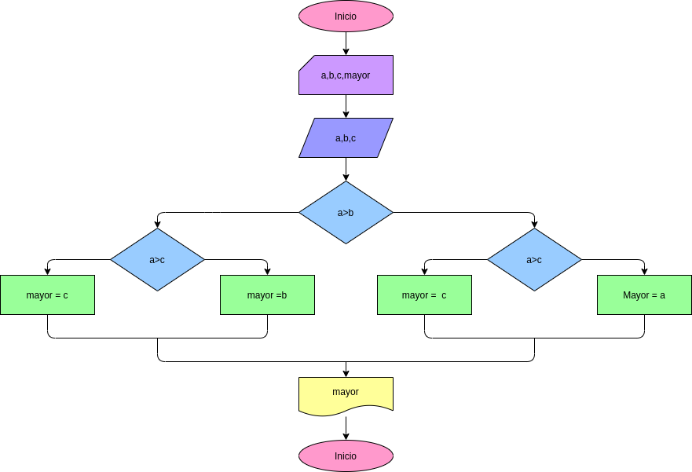

# EJERCICIO 2 ESTRUCTURAS CONDICIONALES

## Programam para hallar el mayor de tres números enteros

## ANALISIS

### Definicion de variables

* a : primer número
* b: segundo número
* c : Tercer número
* mayor : número mayor

Se comparan los tres valores entre si para hallar el mas grande.

## DISEÑO

